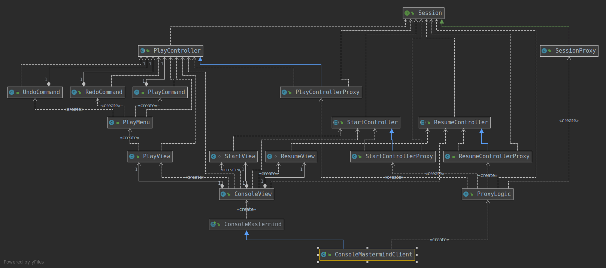

# Práctica de Patrones y Arquitecturas Software👋

## Mastermind version mvp.pm.withProxy

### Diagrama de clases

## Author

 Basado en la solucion mvp.pm.withComposite  

👤 *Álvaro P. Guzman López*

* Github: [@alwar](https://github.com/alwar)
